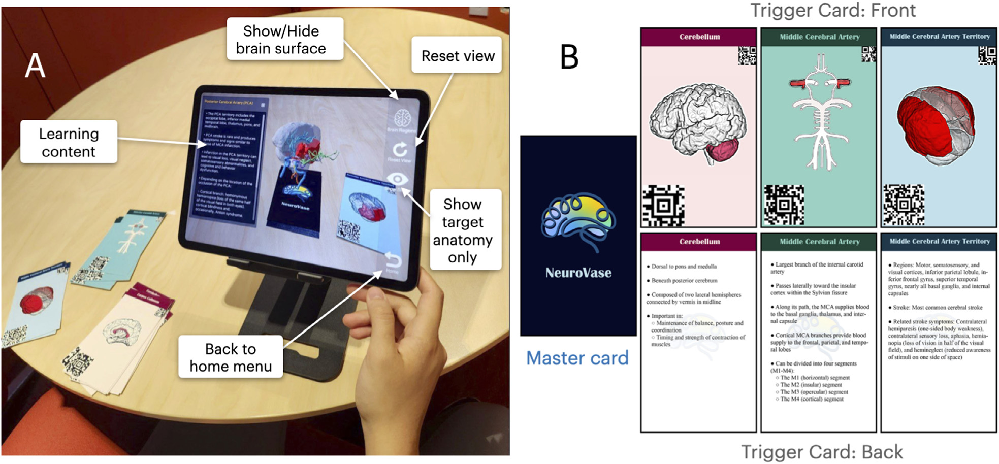
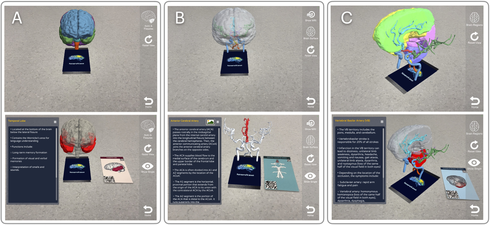
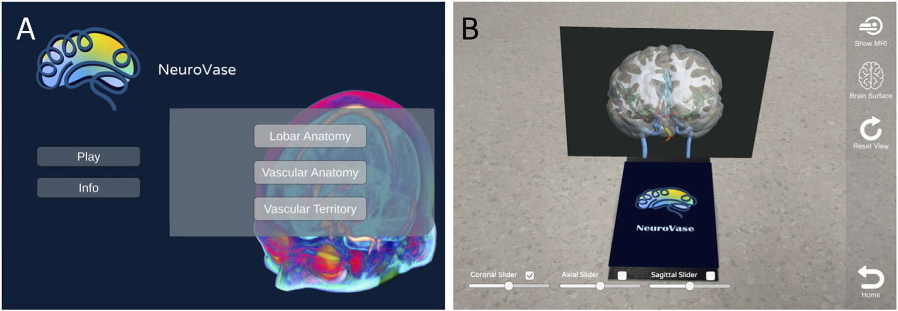
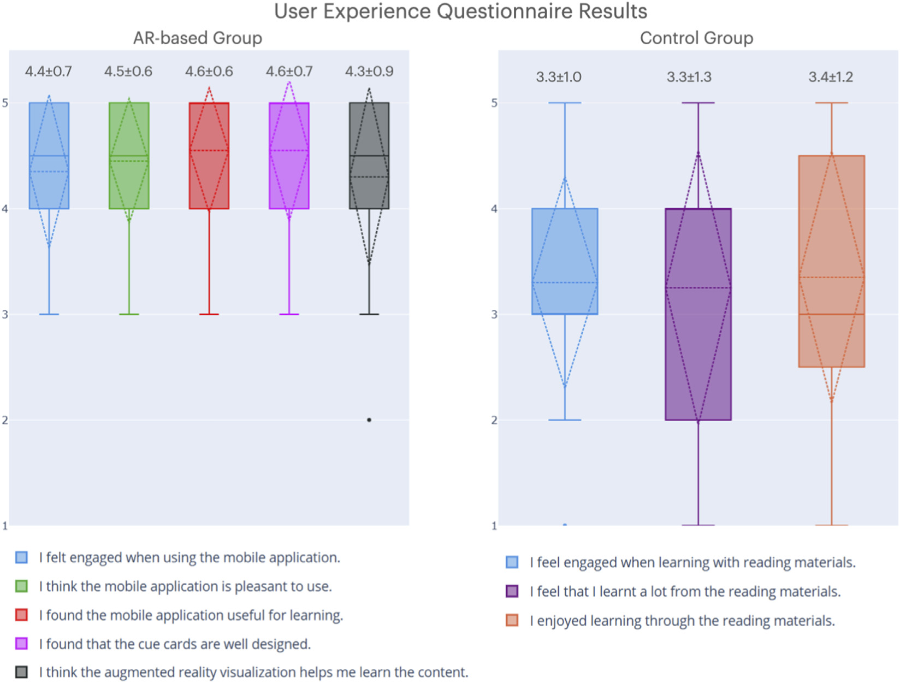

# NeuroVase: Mobile AR for Neurovascular Anatomy and Stroke Education

**NeuroVase** is a tablet-based augmented reality learning system that teaches brain anatomy, cerebral arteries and stroke-related vascular territories. It combines a Unity iPad app with a deck of physical **cue cards**: you can read the cards as study aids, and you can also point the tablet at them to bring up interactive 3D anatomy in AR.

It was my M.Sc. thesis project at Concordia University (Health-X Lab, supervisor Prof. Yiming Xiao), published in *Frontiers in Virtual Reality* (2026).

📄 **Paper:** [NeuroVase: A tangible mobile augmented reality learning system for neurovascular anatomy and stroke education](https://doi.org/10.3389/frvir.2026.1843234) (open access)  
🗂️ **Study materials (OSF):** [printable cue cards and learning curriculum](https://osf.io/7bq2s/) · DOI [10.17605/OSF.IO/7BQ2S](https://doi.org/10.17605/OSF.IO/7BQ2S)

> **Source code:** the application code is in a private lab repository (`HealthX-Lab/NeuroVase`) and is not publicly available. I'm happy to walk through the code and architecture on request. This repository documents the project and my role in it.


*Left: NeuroVase running on an iPad, with the AR model anchored on the master card and the UI controls. Right: the master card and three trigger cards (front and back). Figures in this README are from Jahani et al., Frontiers in Virtual Reality 7:1843234 (2026), CC BY 4.0.*

## How it works

- **Tangible cue cards.** One **master card** anchors the 3D model on the table, and 20 colour-coded **trigger cards** (9 brain lobes, 7 vascular structures, 4 arterial territories) switch the AR content to a specific structure. Each card has an anatomical illustration on the front and a short knowledge summary on the back, so the deck also works without the app.
- **Three learning modules:** lobar anatomy, arterial anatomy and vascular territories. Each card only works in its own module, which guides learners through the content in order.
- **Interaction:** pinch to scale, swipe to rotate and move the model, and move the master card to reposition the scene. The UI can toggle the brain surface, isolate the target structure and reset the view.
- **MRI view:** a volume-rendered MRI with coronal, axial and sagittal slice controls, shown together with the 3D anatomy.
- **Stroke content:** links each arterial territory to the symptoms of a stroke in that territory.


*The three modules (lobar anatomy, arterial anatomy, vascular territories) before and after a trigger card is scanned: the target structure is highlighted and its learning content appears.*


*Landing menu, and the MRI view with coronal, axial and sagittal slice controls.*

## Open materials

The printable cue card designs (PDF) and the full text of the learning curriculum used in the app are public on [OSF](https://osf.io/7bq2s/) under CC BY-NC-SA 4.0, so the cards can be printed and used as a study aid.

## 3D anatomy pipeline

- **Brain lobes:** from the BCI-DNI atlas (expert-labelled MRI parcellations); brain surface extracted with BEaST.
- **Arteries:** segmented from T1-weighted MRI and time-of-flight MR angiography of a healthy subject (3T) using a Frangi vesselness filter, then refined manually with a neuroanatomy expert.
- **Vascular territories:** a stroke-based territory atlas (1,298 acute stroke patients) registered non-linearly to the model.
- Meshes cleaned and exported as `.obj` with 3D Slicer, Blender and MeshLab, then imported into Unity.

## Tech

Unity (2023.1), C#, Vuforia Engine (image-target tracking), volume rendering for MRI, Xcode / iOS build for iPad (10th gen, 60 fps), 3D Slicer, Blender, MeshLab.

## User study

A controlled study with **40 participants** (20 using NeuroVase, 20 using paper-based materials with the same text and 2D textbook images), each with a pre-study and post-study quiz (18 questions) and post-study questionnaires.

| Measure | NeuroVase (AR) | Paper-based |
|---|---|---|
| Quiz score, pre → post | 40.8% → 70.3% | 33.9% → 60.6% |
| Engagement (1–5) | **4.4 ± 0.7** | 3.3 ± 1.0 |
| Enjoyment (1–5) | **4.5 ± 0.6** | 3.4 ± 1.2 |
| System Usability Scale (0–100) | **90.0 ± 5.7** | – |

- Both groups improved significantly. The difference in learning gain between groups was not significant, so AR matched paper for learning while being rated much more engaging (p = 0.001) and enjoyable (p = 0.003).
- A SUS score of 90 is well above the 68 benchmark for good usability.
- Participants asked for more detailed models and blood-flow animation, and some reported occasional card-detection glitches.



*User experience ratings (1–5) for the AR group and the paper-based control group.*

## My role

- Led the design and development of the system, from concept to a working iPad app.
- Developed the application in Unity and C# with Vuforia: AR card tracking, the three learning modules, touch interaction, the UI and the MRI view.
- Processed MRI/MRA neuroimaging data into the 3D brain and vascular models.
- Ran the 40-participant user study, analysed the results and wrote the paper as first author.

## Citation

```bibtex
@article{jahani2026neurovase,
  title   = {NeuroVase: A tangible mobile augmented reality learning system for neurovascular anatomy and stroke education},
  author  = {Jahani, Bahar and Kaseka, Matsanga Leyila and Kersten-Oertel, Marta and Xiao, Yiming},
  journal = {Frontiers in Virtual Reality},
  volume  = {7},
  pages   = {1843234},
  year    = {2026},
  doi     = {10.3389/frvir.2026.1843234}
}
```

## Author

Bahar Jahani · [LinkedIn](https://www.linkedin.com/in/bahar-jahani-a711a81b3)
